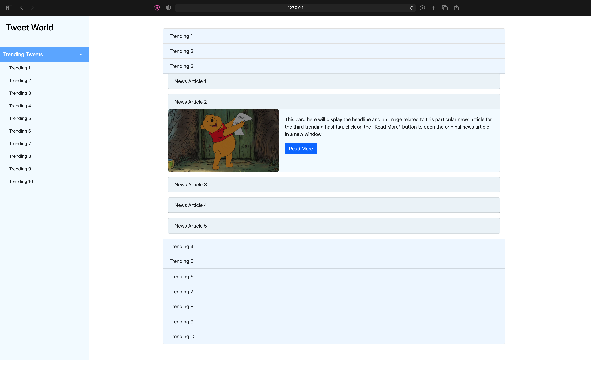

# Tweet World

Tweet World is a web application powered by [Flask](https://flask.palletsprojects.com/en/1.1.x/) and [Bootstrap](https://getbootstrap.com/docs/3.4/css/). The web app's content is dynamic and displays related news articles for trending hashtags on [Twitter](https://twitter.com).

## Installation

Use the package manager [pip](https://pip.pypa.io/en/stable/) to install the necessary dependencies for Tweet World to run.

```bash
pip install -r requirements.txt
```

## Usage
Get API keys from [Twitter](https://twitter.com) and [NEWS API](https://newsapi.org). Set the following three environment variables.

#### Windows
```cmd
set TWITTER_API_KEY=twitter_api_key
set TWITTER_API_SECRET=twitter_api_secret
set NEWS_API=news_api_key
```

#### Linux/macOS
```bash
export TWITTER_API_KEY=twitter_api_key
export TWITTER_API_SECRET=twitter_api_secret
export NEWS_API=news_api_key
```

### Starting the Development Server

#### Windows
```cmd
set FLASK_APP=app.py
set FLASK_DEBUG=True
```

#### Linux/macOS
```bash
export FLASK_APP=app.py
export FLASK_DEBUG=True
```

```shell
flask run
```

Visit [http://127.0.0.1:5000/](http://127.0.0.1:5000/) to view the homepage.



## License
[MIT](https://choosealicense.com/licenses/mit/)